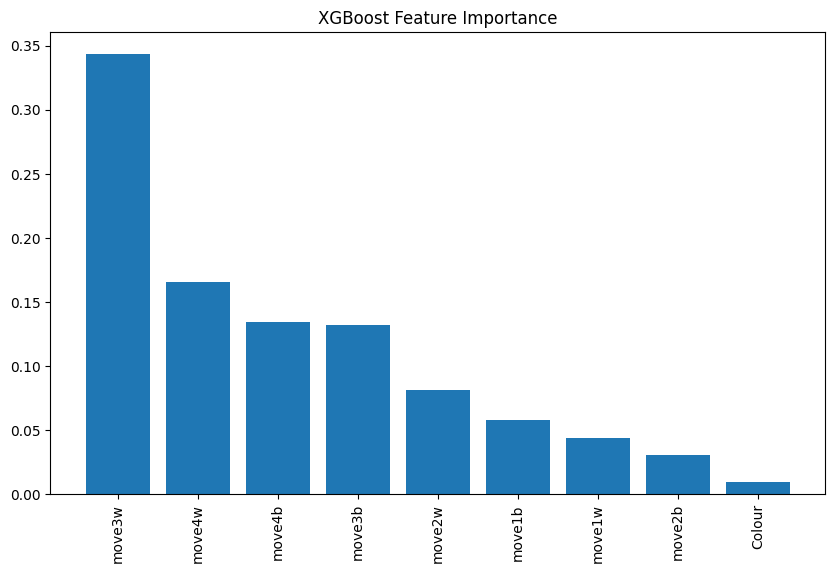

# Chess Opening Classifier

## 📌 Objective  
This project aims to build **classification models** that predict the chess opening based on the **first few moves**. The goal is to analyze move patterns and use machine learning to make accurate predictions.

## 📂 Dataset  
The dataset consists of recorded chess games with the following structure:
- **Target Variable (`Opening`)**: The name of the chess opening played.
- **Features (Predictors)**:
  - `move1w`, `move1b` – First moves by white and black.
  - `move2w`, `move2b` – Second moves by white and black.
  - `move3w`, `move3b` – Third moves by white and black.
  - `move4w`, `move4b` – Fourth moves by white and black.
  - `Colour` – Indicates if the player is **white or black**.

## 🏆 Models Used  
We explore multiple classifiers to determine the best-performing model:
1. **Random Forest** – Ensemble learning for robust classification.
2. **Support Vector Machine (SVM)** – Finds optimal decision boundaries.
3. **XGBoost** – Boosted trees for superior predictive performance.
4. **K-Nearest Neighbors (KNN)** – Measures similarity to classify openings.
5. **Logistic Regression** – Simple probabilistic classification.
6. **Neural Network (MLPClassifier)** – Deep learning-based model.

## 🚀 Features  
- Encodes chess moves using **Label Encoding** for numerical representation.  
- Evaluates **multiple classifiers** to compare accuracy and performance.  
- Provides **visualizations** for model evaluation and feature importance.

## 🏁 Model Visualizations  
Each trained classifier is visualized to understand its decision-making process:

### **Random Forest - Decision Tree Visualization**  

### **SVM - Decision Boundary**  

### **XGBoost - Feature Importance**  

### **KNN - Classification Boundaries**  

### **Logistic Regression - Probability Distribution**  

### **Neural Network - Training Loss Curve**  

## 🔧 Installation & Setup  
Click COLAP Link And Downalod Dataset then You are Ready to start 
